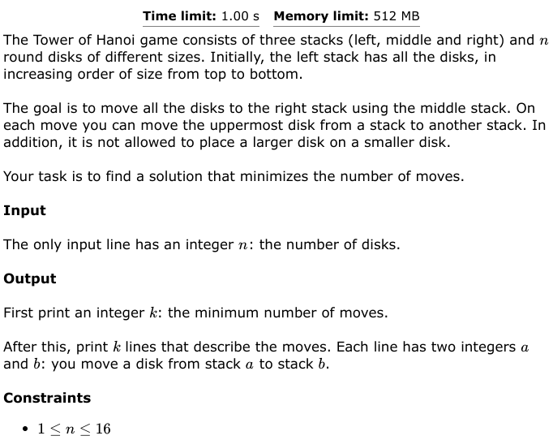
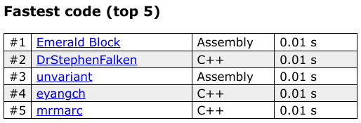

# TOWERS OF HANOI

1. [Problem](#problem)
2. [Solutions](#solution)
3. [Leaderboard](#leaderboard)

## Problem <a name="problem"></a>


## Solutions <a name="solutions"></a>
[https://en.wikipedia.org/wiki/Tower_of_Hanoi](https://en.wikipedia.org/wiki/Tower_of_Hanoi)

1. Grey code solution
The grey code is a set of bit strings each of length *n* where the [Hamming distance]() between each consectutive bit string is 1.

```x86asm
;;; example grey code of length 2
00
01
11
10
```

There is actually a relationship between the grey code and the tower of hanoi. If the disks are numbers from n-1 to 0 (starting at the largest disk and ending at the smallest disk) the bit index of the bit that changes between consectutive strings in the grey code corresponds to the disk number that must be moved for that iteration.

| towers of hanoi | grey code |
|-----------------|-----------|
| <pre>0| |<br>1| |<br>-----<br></pre>

 | |
1|0|
-----

 | |
 |0|1
-----

 | |0
 | |1
-----

## Leaderboard

3rd fastest as of 2022 September 8 23:35