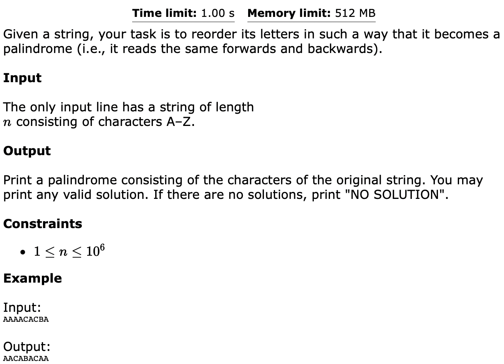
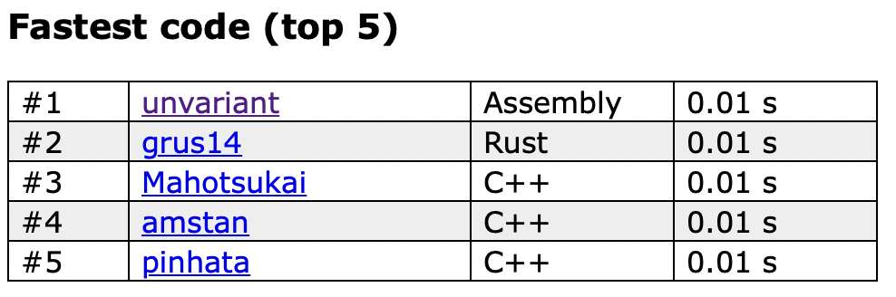

# PALINDROME REORDER

1. [Problem](#problem)
2. [Solution](#solution)
3. [Code Explanation](#explanation)
4. [Leaderboard](#standing)

## Problem <a name="problem"></a>


## Solution <a name="solution"></a>
In order to build a palindrome, there can only be 0 or 1 characters with an odd occurance count. Otherwise it is impossible to build a palindrome, and instead `"NO SOLUTION"` is outputted.

Once a count of the character occurances is calculated, the palindrome can be built in two different ways.
1. build the left half of the palindrome, add the middle character (if any), add the right half of the palindrome
    - implemented in `linear.asm`

2. build the left and right halves simultaneously moving outward from the middle, add the middle character (if any) afterwards
    - implemented in `double.asm`

## Code Explanation for `linear.asm` <a name="explanation"></a>
```x86asm
_start:
    mov     rsi,     buffer
    mov     rdx,     buffer_len
    syscall
```
To perform a read syscall `rax` should be set to 0 for SYS_read, for `rdi` should be set to 0 for stdin. But these registers are not set to 0, so why does the code still work?. This is because when a program starts all the registers are zeroed by the linux kernel, so userspace programs can not peek at values leftover by the kernel in the registers.

```x86asm
    lea     rcx,     [rax - 1]
    ;;; --- snip ---
    xor     rax,     rax

bucket_count:
    lodsb
    inc     qword [bucket_start + rax * 8]
    dec     rcx
    jnz     bucket_count
```
The read syscall returns the number of bytes successfully written to the buffer in `rax` (it returns -1 on error and programs should check for this). The return value can be used to calculate the number of iterations needed to count the occurences of each character in the input string.

```x86asm
    mov     ecx,     0x5A
    mov     dl,      1
    xor     eax,     eax
```
`ecx` is set to the ascii value of capital Z, `dl` is set to the maximum number of odd character counts, and `eax` is set to 0. `eax` is used later to store the ascii value of the character with the odd number od occurances (if any).

```x86asm
check:
    mov     rsi,     qword [bucket_start + ecx * 8]
    shr     rsi,     1

    cmovc   eax,     ecx
    setc    bl

    mov     qword [bucket_start + ecx * 8], rsi
    sub     dl,      bl

    dec     ecx
    cmp     ecx,     0x40
    jnz     check
```
The number of character occurances for a character (repeated for every character A-Z) is loaded into `rsi`, then shifted right once and written back to the bucket array for later use. In x86_64 the shift instructions shift the extra bits into the carry flag. The code can take advantage of this by using conditionally executed instructions instead of branching. Every time the code encounters a character with an odd number of occurances `eax` is set to that character and `dl` is decremented by one.

```x86asm
    cmp     dl,      0
    jl      no_solution
```
After the check loop is finished `dl` is checked for the number of odd character counts, if it is less than zero than more than 1 odd character count was found and it is impossible to build a palindrome. At this point the program can immeadiately print `"NO SOLUTION"` and exit.

```x86asm
    mov     ecx,     25
    vmovdqa ymm7,    yword [alpha_z]
    vmovdqa ymm1,    yword [numeric_one]
```
`ecx` is set the number of loop iterations. `ymm7` is filled with the ascii value for Z, and `ymm1` is filled with 1s.

```x86asm
low:
    mov     rdx,     qword [bucket + ecx * 8]

    lea     rbx,     [rdx + 31]
    shr     rbx,     5
    jz      .skip_loop
    mov     rsi,     rdi

.loop:
    vmovdqu yword [rsi], ymm7
    add     rsi,     32
    dec     rbx
    jnz     .loop
    
.skip_loop:
    vpsubb  ymm7,    ymm7,     ymm1
    add     rdi,     rdx
    dec     ecx
    jge     low
```
The number of character occurances is loaded into `rdx`. `rdx` is then rounded up to the nearest multiple of 32, divided by 32 and stored in `rbx` (32 is the number of bytes that fit into a single `ymm` register). If the value after the divide is zero then the inner loop is skipped and the outer loop continues to the next iteration. Within the inner loop it copies the current character into the output buffer 32 bytes at a time. Normally this sort of memcpy operation would have a vectorized part for bulk transfer and a scalar part to deal with residual bytes. However here the code does not need to deal with residual bytes because the exact number of bytes that need to be is known, so the buffer is simply updated to that point and the next iteration will overwrite and overflowed characters from the previous iteration. At the end of each loop iteration each byte in `ymm7` in decremented to the next capital ascii character in the sequence.

```x86asm
mid:
    xor     edx,     edx
    test    eax,     eax
    setnz   dl

    mov     byte [rdi], al

    ;;; --- snip ---
    add     rdi,     rdx
```
If `eax` is non zero then it signals that there is a middle byte that must be inserted. Otherwise the middle byte should be ignored. Instead of using a branch, the middle byte in unconditionally written into the buffer, but the buffer only increments when `eax` is non zero. This effectively ignores the middle bytes when `eax` is zero, and manages to avoid branching.

```x86asm
    vpaddb  ymm7,    ymm7,    ymm1
    mov     ecx,     25
    add     rdi,     rdx
    mov     rax,     bucket

high:
    mov     rdx,     qword [rax]

    lea     rbx,     [rdx + 31]
    shr     rbx,     5
    jz      .skip_loop
    mov     rsi,     rdi

.loop:
    vmovdqu yword [rsi], ymm7
    add     rsi,     32
    dec     rbx
    jnz     .loop

.skip_loop:
    vpaddb  ymm7,    ymm7,     ymm1
    add     rdi,     rdx
    add     rax,     8
    dec     ecx
    jge     high
```
Almost exactly the same code as the code that handles the low half of the palindrome to handle the high half of the palindrome, just some small tweaks.

```x86asm
solution:
    mov     eax,     1
    mov     rdx,     rdi
    mov     rsi,     output
    sub     rdx,     output
    mov     edi,     1
    syscall

    mov     eax,     60
    xor     edi,     edi
    syscall
```
The exact number of bytes that should be outputted is calculated by subtracting the address of the output buffer base from the address of the end of the output buffer. The output buffer is written to stdout and then the program exits.

## Leaderboard <a name="standing"></a>

Fastest solution as of 2022 September 6th 22:33